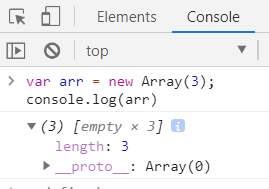

# ES5 新增数组方法总览

ES5 新增了一些数组方法，灵活运用这些方法可以让我们少些很多代码，而且可以在一定程度上替代 underscore/lodash 等工具库。

+ `forEach`: 遍历数组一个数组
+ `map`: 将数组映射为一个新数组
+ `filter`: 过滤数组，找出符合某种条件的元素，将其组合成新数组
+ `some`: 判断是否**一个或多个**的数组元素符合某种条件的
+ `every`: 判断是否**所有**的数组元素都符合某种条件
+ `indexOf`: 得到一个值在数组中**首次**出现的索引
+ `lastIndexOf`: 得到一个值在数组中**最后一次**出现的索引
+ `reduce`: 对一个数组进行迭代递归操作
+ `reduceRight`: 作用同 `reduce`，但是是从数组最后一项向第一项进行遍历
+ `isArray`: 判断一个值是否是 `Array` 类型

其中有一部分方法有一些相同之处：相同的参数。

第一个参数是一个函数，第二个参数是第一个参数函数执行时的上下文环境，即 `this` 指向，第二个参数非必需。

而且第一个参数函数有三个参数：数组元素、元素索引和数组本身。


###

## 注意

1. 这些方法遍历时会跳过值为空的元素。

这里的“值为空”不是指 `null` 或 `undefined`，而是使用构造函数创建且未指定元素值的数组元素。

```js
var arr = new Array(3);
console.log(arr);
```

