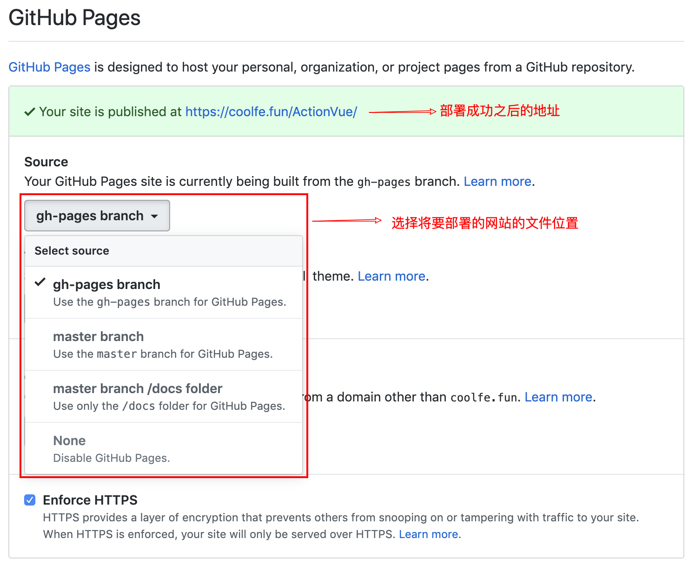

# 前端项目自动打包并部署到 gh-pages

## 介绍一下 GitHub Pages

> GitHub Pages is designed to host your personal, organization, or project pages from a GitHub repository.

翻译过来就是，GitHub Pages 可以帮助你部署个人的，或者组织的，或者项目的网站。

具体的设置如下：你可以在自己 github 仓库的 settings 页面中的 options 选项的 tab 页中找到 GitHub Pages 功能，如图所示



可以看到有四个选项，分别是 
+ `gh-pages` 分支（如果当前 git 仓库有这个分支，才会显示该选项）
+ `master` 分支
+ `master` 分支下的 `docs` 目录（如果没有这个目录，该选项是禁用状态）
+ `None`：关闭这个功能。

前三个选项用于选择网站代码的位置，选择任意一个之后，网页上会自动显示部署之后的网址，如果你是头一次使用这个功能，打开这个网址可能什么都没有，那么等待几分钟之后再次尝试就可以看到效果了。

## 脚本内容

下面脚本适用于前端类项目，即使用 `npm run build` 命令来编译的项目。

大致流程如下：
1. 使用 `npm run build` 编译
2. 进入编译后输出的文件目录
3. 创建 CNAME 文件，用于自定义域名，可酌情注释
4. 将文件目录初始化为一个 git 仓库，使用日期做为 commit 信息并提交到远程仓库

其中具体的目录、仓库地址、分支、自定义域名记得改成自己的。

```sh
#!/usr/bin/env sh

# 确保脚本抛出遇到的错误
set -e

# 生成静态文件
npm run build

# 定义变量
destDir="docs/.vuepress/dist"
currTime1=`date +%Y-%m-%d`
currTime2=`date +%H:%M:%S`
commit=":rocket: deploy @${currTime1} ${currTime2}"
repo="https://github.com/wencaizhang/wencaizhang.github.io.git"
remoteBranch="master"
domain="coolfe.fun"

# 进入生成的文件夹
cd $destDir

# 发布到自定义域名
echo $domain > CNAME

# 将前端静态文件初始化为 git 仓库并提交
git init
git add -A
git commit -m "$commit"

git push -f $repo master:$remoteBranch

# 回到上次工作目录
cd -
```
